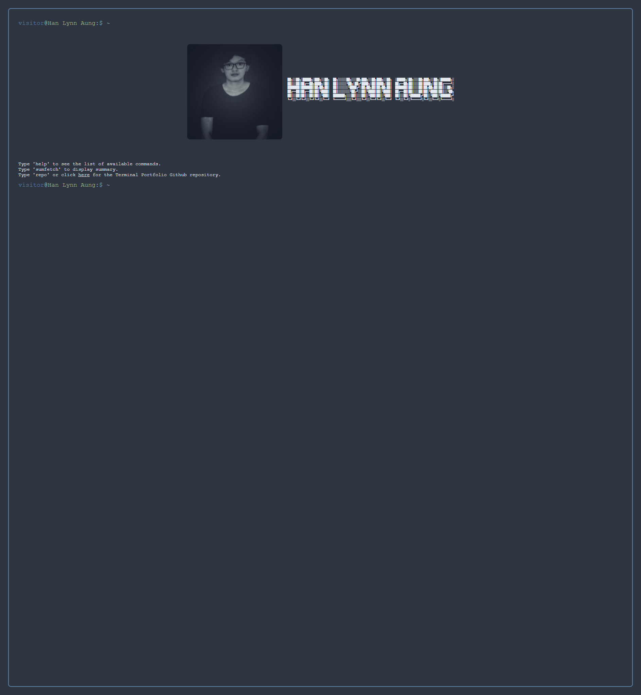

<div align="center">
  
</div>

<div align="center">
  <a href="https://git.io/typing-svg">
    
  </a>
</div>

---

<div align="center">
  <table>
    <tr>
      <td width="33%">
        
      </td>
      <td width="33%">
        
      </td>
      <td width="33%">
        
      </td>
    </tr>
  </table>
</div>

---

## 🎯 About Me

<div align="center">
  <table width="100%">
    <tr>
      <td width="50%">
        
      </td>
      <td width="50%" valign="top">
        <div align="left">
          <p><strong>👨‍💻 Java Backend Developer</strong> from Myanmar 🇲🇲</p>
          <p>Passionate about building <strong>scalable microservices</strong>, <strong>robust REST APIs</strong>, and <strong>enterprise-grade solutions</strong>.</p>
          <p><strong>💡 Expertise:</strong></p>
          <ul>
            <li>Java & Spring Boot Ecosystem</li>
            <li>Microservices Architecture</li>
            <li>RESTful API Design</li>
            <li>Database Optimization</li>
            <li>Cloud Technologies (AWS)</li>
            <li>DevOps & Containerization</li>
          </ul>
          <p><strong>🎯 Currently:</strong> Architecting scalable backend systems & mentoring development teams</p>
          <p><strong>🌱 Exploring:</strong> System Design, Advanced Cloud Patterns, Modern Frontend</p>
        </div>
      </td>
    </tr>
  </table>
</div>

---

## 💼 Professional Experience & Impact

<div align="center">
  <table width="100%">
    <tr>
      <td align="center" width="50%">
        <div style="background: linear-gradient(135deg, #667eea 0%, #764ba2 100%); padding: 30px; border-radius: 15px; margin: 10px;">
          <h3>🏛️ E-Governance Oil Distribution System</h3>
          <p><strong>Enterprise Government Digitization</strong></p>
          <hr style="border: 1px solid rgba(255,255,255,0.3);">
          <div align="left">
            <p><strong>🎯 Key Achievements:</strong></p>
            <ul>
              <li>🔗 <strong>Multi-Platform Integration</strong> - 4 major systems (Taw Win Akariz, CTZ Pay, Panamax)</li>
              <li>📊 <strong>90% Efficiency Gain</strong> - Automated workflows & data flow</li>
              <li>📈 <strong>Quota Tracking</strong> - Real-time system serving 100+ merchants (90% accuracy)</li>
              <li>📋 <strong>Advanced Reporting</strong> - Merchants, retailers, households dashboards</li>
              <li>✅ <strong>On-Time Delivery</strong> - All milestones completed on schedule</li>
            </ul>
          </div>
          <div align="center" style="margin-top: 15px;">
            
            
            
          </div>
        </div>
      </td>
      <td align="center" width="50%">
        <div style="background: linear-gradient(135deg, #f093fb 0%, #f5576c 100%); padding: 30px; border-radius: 15px; margin: 10px;">
          <h3>🎁 Loyalty & Rewards System</h3>
          <p><strong>Enterprise Rewards Platform</strong></p>
          <hr style="border: 1px solid rgba(255,255,255,0.3);">
          <div align="left">
            <p><strong>🎯 Key Achievements:</strong></p>
            <ul>
              <li>🏢 <strong>Enterprise Integration</strong> - G&G, Capital, Panamax systems</li>
              <li>📊 <strong>90% Accuracy</strong> - Improved reporting with recognition from teams</li>
              <li>👥 <strong>Team Mentorship</strong> - Guided 2+ interns to success</li>
              <li>🚀 <strong>60% Performance Gain</strong> - Enhanced efficiency & reduced latency</li>
              <li>✅ <strong>100% On-Time</strong> - Consistent delivery without quality compromise</li>
            </ul>
          </div>
          <div align="center" style="margin-top: 15px;">
            
            
            
          </div>
        </div>
      </td>
    </tr>
  </table>
</div>

---

## 🌟 Professional Highlights

<div align="center">
  <table width="100%">
    <tr>
      <td align="center" width="25%">
        <div style="background: rgba(102, 126, 234, 0.1); padding: 25px; border-radius: 12px; border-left: 4px solid #667eea;">
          
          <h4>Java Mastery</h4>
          <p>2+ Years<br>Production Experience</p>
        </div>
      </td>
      <td align="center" width="25%">
        <div style="background: rgba(102, 126, 234, 0.1); padding: 25px; border-radius: 12px; border-left: 4px solid #764ba2;">
          
          <h4>Spring Ecosystem</h4>
          <p>Boot • Security • Data</p>
        </div>
      </td>
      <td align="center" width="25%">
        <div style="background: rgba(102, 126, 234, 0.1); padding: 25px; border-radius: 12px; border-left: 4px solid #667eea;">
          
          <h4>API Architecture</h4>
          <p>RESTful • GraphQL<br>Microservices</p>
        </div>
      </td>
      <td align="center" width="25%">
        <div style="background: rgba(102, 126, 234, 0.1); padding: 25px; border-radius: 12px; border-left: 4px solid #764ba2;">
          
          <h4>Technical Leadership</h4>
          <p>Mentoring • Team Growth<br>Code Excellence</p>
        </div>
      </td>
    </tr>
  </table>
</div>

---

## 💻 Tech Arsenal

<div align="center">

### 🚀 Backend Development


<br><br>

### 🗄️ Database & Caching


<br><br>

### 🌐 Frontend & UI


<br><br>

### ⚙️ DevOps & Cloud


<br><br>

### 🛠️ Tools & IDEs


</div>


---

## 🎨 Development Activity

<div align="center">
  
</div>

<br/>

<div align="center">
  <h3>📊 Weekly Code Breakdown</h3>
</div>

<!--START_SECTION:waka-->

```txt
From: 31 January 2024 - To: 19 April 2026

Total Time: 214 hrs 48 mins

Java                                   195 hrs 32 mins       ██████████████████████▓░░   91.02 %
SQL                                    7 hrs 44 mins         █░░░░░░░░░░░░░░░░░░░░░░░░   03.60 %
YAML                                   4 hrs 14 mins         ▒░░░░░░░░░░░░░░░░░░░░░░░░   01.97 %
Log                                    2 hrs 21 mins         ▒░░░░░░░░░░░░░░░░░░░░░░░░   01.10 %
XML                                    2 hrs                 ▒░░░░░░░░░░░░░░░░░░░░░░░░   00.93 %
```

<!--END_SECTION:waka-->

---

## 🚀 What I'm Up To

<div align="center">
  <table width="100%">
    <tr>
      <td width="50%">
        <div style="border-radius: 15px; overflow: hidden; box-shadow: 0 10px 30px rgba(102, 126, 234, 0.2);">
          <a href="https://hanlynnaung-portfolio-ky6ft6bnj-han-lynn-aung.vercel.app/" target="_blank">
            
          </a>
        </div>
        <br>
        <a href="https://hanlynnaung-portfolio-ky6ft6bnj-han-lynn-aung.vercel.app/" target="_blank">
          
        </a>
      </td>
      <td width="50%" valign="top" style="padding: 20px;">
        <h3 style="color: #667eea;">🔭 Current Focus Areas</h3>
        <div align="left" style="background: rgba(102, 126, 234, 0.05); padding: 20px; border-radius: 12px; border-left: 4px solid #667eea;">
          <p><strong>🏗️ Microservices Architecture</strong><br>Building scalable distributed systems with event-driven patterns</p>
          <br>
          <p><strong>⚛️ React.js Ecosystem</strong><br>Modern frontend development with TypeScript</p>
          <br>
          <p><strong>☁️ Cloud Technologies</strong><br>AWS, Docker, Kubernetes deployment strategies</p>
          <br>
          <p><strong>🌱 Open Source</strong><br>Contributing to community-driven projects</p>
          <br>
          <p><strong>📚 System Design</strong><br>Scalable architecture patterns & best practices</p>
        </div>
      </td>
    </tr>
  </table>
</div>

---

## 🌐 Featured Projects Showcase

<div align="center">
  <table width="100%">
    <tr>
      <td width="50%">
        <div style="background: linear-gradient(135deg, #667eea 0%, #764ba2 100%); padding: 30px; border-radius: 15px; color: white; box-shadow: 0 10px 30px rgba(102, 126, 234, 0.3);">
          <h3>🏛️ E-Governance Oil Distribution</h3>
          <p style="font-size: 14px; opacity: 0.9;">Government digitization with multi-platform integration</p>
          <div style="text-align: center; margin: 15px 0;">
            
            
            
          </div>
          <hr style="border: 1px solid rgba(255,255,255,0.2);">
          <p style="font-size: 13px; text-align: left; line-height: 1.6;">
            ✅ 100+ merchants served<br>
            ✅ 99.9% accuracy tracking<br>
            ✅ 90% efficiency improvement<br>
            ✅ 2-system integration
          </p>
        </div>
      </td>
      <td width="50%">
        <div style="background: linear-gradient(135deg, #f093fb 0%, #f5576c 100%); padding: 30px; border-radius: 15px; color: white; box-shadow: 0 10px 30px rgba(245, 87, 108, 0.3);">
          <h3>🎁 Loyalty & Rewards System</h3>
          <p style="font-size: 14px; opacity: 0.9;">Enterprise rewards platform with advanced analytics</p>
          <div style="text-align: center; margin: 15px 0;">
            
            
            
          </div>
          <hr style="border: 1px solid rgba(255,255,255,0.2);">
          <p style="font-size: 13px; text-align: left; line-height: 1.6;">
            ✅ Multi-company integration<br>
            ✅ 95% accuracy improvement<br>
            ✅ 60% performance boost<br>
            ✅ 100% on-time delivery
          </p>
        </div>
      </td>
    </tr>
  </table>
</div>

---

## 🎵 Beyond The Code

<div align="center">
  <table width="100%">
    <tr>
      <td width="50%">
        <div style="background: rgba(102, 126, 234, 0.1); padding: 25px; border-radius: 12px; border: 2px solid #667eea;">
          <h3>🎧 Coding Playlist Vibes</h3>
          
          <br><br>
          <div align="left">
            <p>🎵 <strong>Lo-fi Hip Hop</strong> → Deep focus sessions</p>
            <p>🎸 <strong>Instrumental Rock</strong> → Problem solving</p>
            <p>🎹 <strong>Ambient Electronic</strong> → Code reviews</p>
            <p>🥁 <strong>Upbeat Pop</strong> → Feature development</p>
          </div>
        </div>
      </td>
      <td width="50%">
        <div style="background: rgba(102, 126, 234, 0.1); padding: 25px; border-radius: 12px; border: 2px solid #764ba2;">
          <h3>⏰ Coding Schedule</h3>
          
          <br><br>
          <div align="left">
            <p>🌅 <strong>6:00 AM - 9:00 AM</strong> → Personal development</p>
            <p>☀️ <strong>9:00 AM - 6:00 PM</strong> → Professional work</p>
            <p>🌆 <strong>9:00 PM - 12:00 AM</strong> → Learning & OSS</p>
            <p>🌙 <strong>Weekends</strong> → Side projects</p>
          </div>
        </div>
      </td>
    </tr>
  </table>
</div>

---

## 🎯 2025 Goals

<div align="center">
  <table width="100%">
    <tr>
      <td align="center" width="50%">
        <div style="background: linear-gradient(135deg, #667eea 0%, #764ba2 100%); padding: 25px; border-radius: 12px; color: white;">
          
          <h4>Open Source Contributions</h4>
          <p style="font-size: 24px; margin: 10px 0; font-weight: bold;">50+</p>
          <p>Contributing to community-driven projects</p>
        </div>
      </td>
      <td align="center" width="50%">
        <div style="background: linear-gradient(135deg, #f093fb 0%, #f5576c 100%); padding: 25px; border-radius: 12px; color: white;">
          
          <h4>Tech Leadership</h4>
          <p style="font-size: 24px; margin: 10px 0; font-weight: bold;">100%</p>
          <p>Mentoring & Technical Speaking</p>
        </div>
      </td>
    </tr>
  </table>
</div>

---

## 🤝 Let's Connect & Collaborate

<div align="center">
  <h2 style="color: #667eea; margin-bottom: 30px;">Open to Opportunities</h2>

  <table width="100%">
    <tr align="center">
      <td width="20%">
        
      </td>
      <td width="20%">
        
      </td>
      <td width="20%">
        
      </td>
      <td width="20%">
        
      </td>
      <td width="20%">
        
      </td>
    </tr>
  </table>

  <h4 style="color: #667eea; margin-top: 30px;">⚡ Response Time: Within 48 hours</h4>

  <br>

  <a href="https://www.linkedin.com/in/hanlynn-aung/" target="_blank">
    
  </a>
  &nbsp;
  <a href="mailto:hanlynnaung1997@gmail.com" target="_blank">
    
  </a>
  &nbsp;
  <a href="https://m.facebook.com/profile.php/?id=100010450033197" target="_blank">
    
  </a>
  &nbsp;
  <a href="https://discord.gg/natrix_h" target="_blank">
    
  </a>
  &nbsp;
  <a href="https://medium.com/@hanlynnaung1997" target="_blank">
    
  </a>
  &nbsp;
  <a href="https://substack.com/@hanlynnaung" target="_blank">
    
  </a>

</div>

---

## 💡 Daily Dev Wisdom

<div align="center">
  
</div>

---

## 🐍 Contribution Activity

<div align="center">
  <picture>
    <source media="(prefers-color-scheme: dark)" srcset="https://github.com/hanlynn-aung/hanlynn-aung/blob/output/github-contribution-grid-snake-dark.svg" />
    <source media="(prefers-color-scheme: light)" srcset="https://github.com/hanlynn-aung/hanlynn-aung/blob/output/github-contribution-grid-snake.svg" />
    
  </picture>
</div>

---

<div align="center">
  <a href="https://git.io/typing-svg">
    
  </a>
</div>

<br>

<div align="center">
  
</div>
