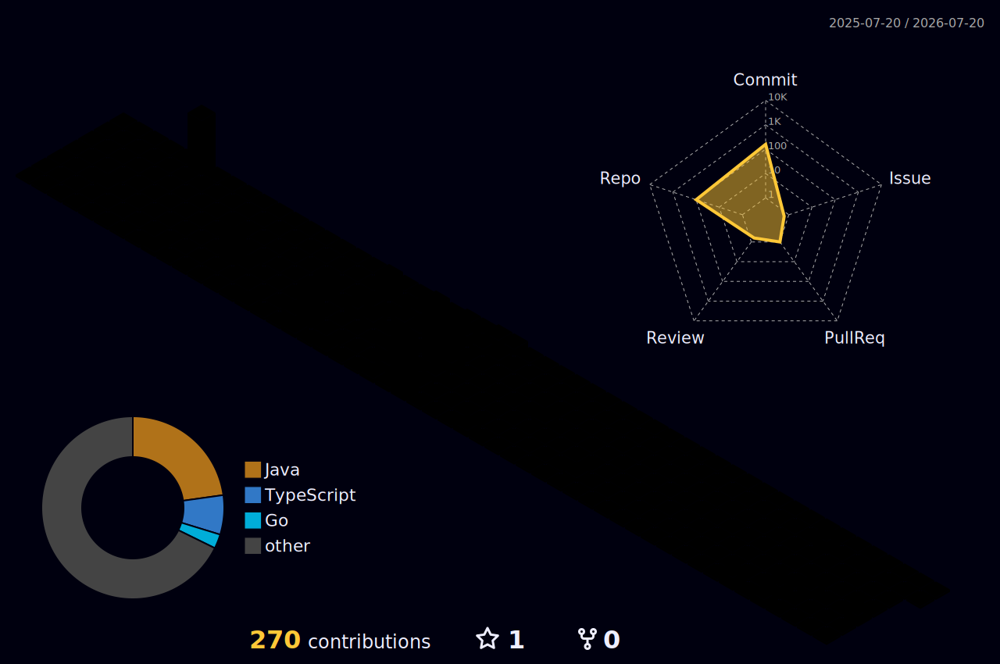

<!-- ╔══════════════════════════════════════════════════════════╗ -->
<!-- ║   Han Lynn Aung · GitHub Profile README                   ║ -->
<!-- ║   Automation anchors (waka / blog / snake) are preserved. ║ -->
<!-- ╚══════════════════════════════════════════════════════════╝ -->

<div align="center">
  
</div>

<div align="center">
  <a href="https://github.com/DenverCoder1/readme-typing-svg">
    
  </a>
</div>

<div align="center">

[](https://github.com/hanlynn-aung)
[](https://github.com/hanlynn-aung?tab=followers)
[](https://github.com/hanlynn-aung)

</div>

<div align="center">

`👋 Hi, I'm Han` &nbsp;•&nbsp; `☕ Java Backend Engineer` &nbsp;•&nbsp; `🌏 Myanmar` &nbsp;•&nbsp; `🚀 Open to collaboration`

</div>

<div align="center">

📍 **Based in** Myanmar 🇲🇲 &nbsp;|&nbsp; 💼 **Backend Engineer** &nbsp;|&nbsp; 🌱 **Learning** System Design & Cloud-Native Patterns

[](https://hanlynnaung-portfolio-74ixsmgju-han-lynn-aung.vercel.app/)
[](mailto:hanlynnaung1997@gmail.com)
[](https://www.linkedin.com/in/hanlynn-aung/)

</div>

---

## 🧭 About Me


I'm a **Java Backend Engineer** with **4+ years** of production experience building **enterprise-grade, high-reliability systems** — from core banking integrations to centralized dispute platforms.

- 🏗️ I design **scalable microservices**, **resilient REST APIs**, and **fault-tolerant transaction pipelines**.
- 🏦 Deep experience in **fintech & banking** domains — concurrency, data integrity, and zero-loss transaction processing.
- 🤝 I enjoy **mentoring** junior developers and turning complex requirements into clean, maintainable code.
- 🔭 Currently deepening my expertise in **system design**, **event-driven architecture**, and **cloud-native deployment**.
- 💬 Ask me about **Spring Boot**, **microservices**, **API design**, or **database optimization**.

<br clear="right"/>

---

## 🛠️ Tech Stack

<details open>
  <summary><b>Explore my toolbox</b></summary>
  <br>

**Languages**


**Backend**


**Frontend**


**Database**


**Cloud**


**DevOps**


**Messaging**


**Testing**


**Tools**


</details>

### Skills at a glance

<div align="center">
  
</div>

---

## 📊 GitHub Statistics

<div align="center">
  
  
</div>

<div align="center">
  
</div>

<div align="center">
  
</div>

---

## 🚀 Featured Projects

<details open>
  <summary><b>🏦 Agency Banking</b> — Core banking integration with high-reliability transaction processing</summary>
  <br>

> Integrated core banking services with **zero data loss** on transaction failures and safe simultaneous processing under heavy concurrency.

**Tech Stack** &nbsp;   

**Highlights**
- ✅ Zero data loss on transaction failures
- ✅ Resolved structural bottlenecks — improved speed & throughput
- ✅ Concurrency-safe simultaneous transaction processing
- ✅ Scalable database architecture for large-scale operations

🔗 **Repository:** `<add-repo-link>` &nbsp;•&nbsp; 🌐 **Demo:** `<add-demo-link>`

</details>

<details>
  <summary><b>⚖️ Dispute & Chargeback Platform</b> — Centralized dispute management with automated workflows</summary>
  <br>

> A centralized platform that streamlines support workflows and translates banking & compliance requirements into intuitive case management.

**Tech Stack** &nbsp;   

**Highlights**
- ✅ Streamlined case-management workflows
- ✅ Automated document processing, escalations & status notifications
- ✅ Multi-system enterprise integration
- ✅ Real-time dashboards & automated reporting for leadership

🔗 **Repository:** `<add-repo-link>` &nbsp;•&nbsp; 🌐 **Demo:** `<add-demo-link>`

</details>

<details>
  <summary><b>🏆 Loyalty & Rewards</b> — Cross-system rewards integration</summary>
  <br>

> Integrated APIs across multiple platforms and resolved data discrepancies with QA, product and finance teams to deliver on schedule.

**Tech Stack** &nbsp;   

**Highlights**
- ✅ Integrated APIs across multiple core systems
- ✅ Resolved cross-team data discrepancies
- ✅ Improved reporting accuracy & operational efficiency
- ✅ Mentored interns & trainees to successful delivery

🔗 **Repository:** `<add-repo-link>` &nbsp;•&nbsp; 🌐 **Demo:** `<add-demo-link>`

</details>

### 📌 Pinned Repositories

<div align="center">
  <a href="https://github.com/hanlynn-aung/ecom">
    
  </a>
  <a href="https://github.com/hanlynn-aung/learning-mircroservice">
    
  </a>
  <a href="https://github.com/hanlynn-aung/social-media">
    
  </a>
  <a href="https://github.com/hanlynn-aung/Myanmar-NRC-and-Phone-Number-Validator">
    
  </a>
</div>

---

## 🗓️ Experience Timeline

```text
2024 ──▶ Present   Java Backend Engineer
                   Enterprise fintech & banking systems — microservices,
                   core banking integration, dispute & rewards platforms.
                   Mentoring interns and management trainees.

2022 ──▶ 2024      Backend Developer
                   REST APIs, database optimization, and secure user
                   management for merchant & e-governance portals.

2021 ──▶ 2022      Junior Developer
                   Java, Spring Boot fundamentals, and first production
                   feature deliveries.
```

> 💡 *Dates and titles above are placeholders — update with your exact roles, companies, and periods.*

---

## 🎓 Certifications

<div align="center">


</div>

> 💡 *Swap `planned` for the year once earned, and link each badge to its credential.*

---

## 🏅 Achievements

<div align="center">
  
</div>

- 🌱 **Open Source** — contributing to community-driven projects (goal: 50+ contributions in 2026)
- 🤝 **Mentorship** — guided 2+ interns & management trainees to successful delivery
- 🧩 **Hackathons & Competitions** — `<add participation / results>`

---

## 🌱 Currently Learning

<div align="center">


</div>

---

## ✍️ Latest Blog Posts

<div align="center">

[](https://medium.com/@hanlynnaung1997)
[](https://substack.com/@hanlynnaung)

</div>

<!-- BLOG-POST-LIST:START -->
- [HIBERNATE 6 | HIBERNATE ADVANCED
Implement your primary key as a Record using an IdClass](https://medium.com/@hanlynnaung1997/hibernate-6-hibernate-advanced-implement-your-primary-key-as-a-record-using-an-idclass-172bedc2f8dc?source=rss-a0a3cdee224d------2) - Sat Jun 15 2024 5:12 PM<!-- BLOG-POST-LIST:END -->

> 📡 *Auto-updated from Medium & Substack via GitHub Actions.*

---

## ⏱️ Weekly Code Breakdown

<!--START_SECTION:waka-->

```txt
From: 31 January 2024 - To: 23 July 2026

Total Time: 214 hrs 48 mins

Java                                   195 hrs 32 mins       ██████████████████████▓░░   91.02 %
SQL                                    7 hrs 44 mins         █░░░░░░░░░░░░░░░░░░░░░░░░   03.60 %
YAML                                   4 hrs 14 mins         ▒░░░░░░░░░░░░░░░░░░░░░░░░   01.97 %
Log                                    2 hrs 21 mins         ▒░░░░░░░░░░░░░░░░░░░░░░░░   01.10 %
XML                                    2 hrs                 ▒░░░░░░░░░░░░░░░░░░░░░░░░   00.93 %
```

<!--END_SECTION:waka-->

---

## 🎨 3D Contribution Graph

<div align="center">
  
</div>

---

## 🤝 Connect with Me

<div align="center">

[](https://www.linkedin.com/in/hanlynn-aung/)
[](https://hanlynnaung-portfolio-74ixsmgju-han-lynn-aung.vercel.app/)
[](mailto:hanlynnaung1997@gmail.com)
[](https://twitter.com/)
[](https://medium.com/@hanlynnaung1997)

</div>

> 💡 *Twitter/X link is a placeholder — update the handle or remove the badge.*

---

## 🎲 Fun Facts

- ☕ I debug best with a cup of coffee and lo-fi in the background.
- 🇲🇲 Proudly building software from **Myanmar** for the world.
- 🧠 I believe **clean code** is a form of respect for the next developer.
- 🌙 Most productive between **9 PM and midnight**.
- ⚡ Response time to messages: **within 48 hours**.

---

<div align="center">
  <picture>
    <source media="(prefers-color-scheme: dark)" srcset="https://raw.githubusercontent.com/hanlynn-aung/hanlynn-aung/output/github-contribution-grid-snake-dark.svg" />
    <source media="(prefers-color-scheme: light)" srcset="https://raw.githubusercontent.com/hanlynn-aung/hanlynn-aung/output/github-contribution-grid-snake.svg" />
    
  </picture>
</div>

<div align="center">

### ⭐ Thanks for visiting — let's build something great together!


</div>
