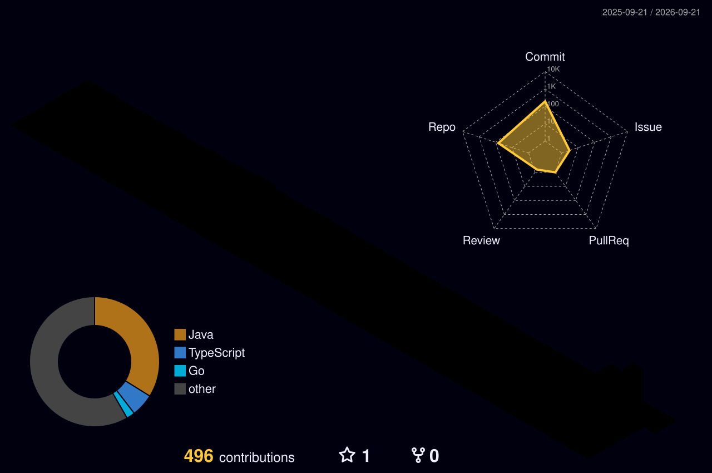

<!-- ════════════════════════════════════════════════════════════════
     Han Lynn Aung · GitHub Profile README
     NOTE: this file is auto-updated by GitHub Actions.
     Do not rename or reformat the waka-time section markers,
     the blog-post-list markers, the snake SVGs served from the
     output branch (main.yml), or the profile-3d-contrib SVG
     regenerated every 6 hours (profile-3d.yml).
     ════════════════════════════════════════════════════════════════ -->

<div align="center">

# Han Lynn Aung

### Java Backend Engineer · Enterprise Fintech & Banking Systems

Building scalable backend systems with Java and Spring Boot — microservices, core banking integrations, and fault-tolerant transaction pipelines engineered for zero data loss under heavy concurrency.

`Java` `Spring Boot` `Oracle` `REST APIs` `Microservices`

[](https://www.linkedin.com/in/hanlynn-aung/)
[](https://terminal-portfolio-five-zeta.vercel.app/)
[](https://medium.com/@hanlynnaung1997)
[](mailto:hanlynnaung1997@gmail.com)

</div>

---

## About

I'm a **Java Backend Engineer** with **4+ years** of experience building mission-critical banking and enterprise systems — currently working on **core banking integrations and centralized dispute platforms** at [KBZ Bank](https://www.kbzbank.com/en/).

My work sits where data integrity is non-negotiable: designing scalable Spring Boot APIs with a strong focus on concurrency, performance optimization, and zero-loss transaction processing under heavy load.

- **Enterprise backend focus** — scalable microservices, resilient REST APIs, transactional integrity
- **Reliability engineering** — zero-loss failure handling and safe concurrent processing
- **Mentorship** — guiding interns and management trainees from requirements to production
- **Currently deepening** — system design, event-driven architecture, cloud-native deployment

*Based in Yangon, Myanmar · Burmese / English · Open to collaboration*

---

## Tech Stack

| Area | Technologies |
|---|---|
| **Languages** | Java · JavaScript · TypeScript · SQL |
| **Backend** | Spring Framework · Spring Boot · Spring Security · Hibernate · REST APIs · Maven · Gradle |
| **Data** | Oracle · PostgreSQL · MySQL · Redis · MongoDB |
| **Messaging** | Apache Kafka · RabbitMQ |
| **Cloud & DevOps** | AWS · Docker · Kubernetes · GitHub Actions · Jenkins · Nginx |
| **Testing & Observability** | JUnit 5 · Mockito · Postman · Prometheus · Grafana |
| **Tools** | Git · IntelliJ IDEA · Swagger · Jasper |

**Primary** — Java · Spring Boot · REST API design · Oracle · SQL

**Secondary** — Redis · Kafka · Docker · AWS · PostgreSQL · Git

*Working knowledge* — React · Thymeleaf · Tailwind CSS · HTML/CSS

---

## Featured Projects

### 01 · Agency Banking Platform

> Core banking integration with high-reliability transaction processing.

**Problem** — Agency-channel transactions demand strict integrity: a failed transaction must never be lost, even while thousands process concurrently.

**Solution** — A transaction platform integrating core banking services with concurrency-safe processing and guaranteed recovery on failure.

**Architecture** — Spring Boot services over a scalability-oriented Oracle schema designed for large-scale transaction tracking.

**Stack** — `Java · Spring Boot · Oracle`

**Highlights**

- Spearheaded core banking integration with zero data loss on transaction failures
- Solved complex concurrency challenges for safe simultaneous processing
- Resolved structural bottlenecks — significantly improved speed and throughput
- Deployed critical backend services: secure authentication and external notifications

*Built at KBZ Bank — enterprise banking platform · repository not public*

---

### 02 · Dispute & Chargeback Platform

> Centralized dispute ticket system modernizing case management and support workflows.

**Problem** — Dispute and chargeback operations span banking rules, compliance requirements, and multiple internal systems — slow and error-prone when handled manually.

**Solution** — A centralized case-management platform translating banking and compliance requirements into intuitive workflows with automation at every step.

**Architecture** — Spring Boot with Oracle persistence, integrated with enterprise systems through event-driven flows; a single source of truth for disputes across the organization.

**Stack** — `Java · Spring Boot · Oracle`

**Highlights**

- Automated document processing, case escalations, and status notifications
- Integrated core enterprise systems into a single source of truth for disputes
- Built real-time dashboards and automated reporting for leadership visibility
- Streamlined end-to-end workflows across support and operations teams

*Built at KBZ Bank — enterprise banking platform · repository not public*

---

### 03 · Loyalty & Rewards Point System

> Cross-system rewards integration delivered fully on schedule.

**Problem** — Reward data lived across multiple core systems, producing discrepancies and unreliable reporting.

**Solution** — Cross-platform API integration with disciplined coordination across QA, product, data, and finance teams to resolve mismatches before launch.

**Architecture** — REST integrations across G&amp;G, Capital, and Panamax systems built on Spring Boot with MySQL persistence.

**Stack** — `Java · Spring Boot · MySQL · REST APIs`

**Highlights**

- Developed and integrated rewards APIs across three core systems
- Shipped on schedule — improved reporting accuracy, earning stakeholder recognition
- Resolved cross-team data discrepancies before launch
- Mentored interns and trainees throughout delivery

*Built at Capital Diamond Star Group — enterprise rewards platform · repository not public*

---

### 04 · Edible Oil E-Governance

> Quota tracking and distribution management for the edible oil supply chain.

**Highlights**

- Designed a robust quota tracking system — improved merchant accuracy and timeliness
- Standardized data across platforms; integrated Taw Win Akariz, CTZ Pay, and Panamax
- Delivered reporting and analysis for merchants, retailers, and households

**Stack** — `Java · Spring Boot · MySQL`

*Built at Capital Diamond Star Group — e-governance platform · repository not public*

---

### 05 · Merchant Portal

> Merchant self-service portal backend.

**Highlights**

- Built backend user-management functionality ensuring secure, efficient operations
- Implemented report downloads, giving stakeholders timely data access
- Integrated systems cross-functionally — delivered on deadline with high maintainability
- Mentored management trainees and interns through delivery

**Stack** — `Java · Spring Boot · Redis`

*Built at Capital Diamond Star Group — enterprise platform · repository not public*

---

## Open Source

| Project | Focus |
|---|---|
| [Myanmar-NRC-and-Phone-Number-Validator](https://github.com/hanlynn-aung/Myanmar-NRC-and-Phone-Number-Validator) | Myanmar NRC format and phone number validation |
| [learning-mircroservice](https://github.com/hanlynn-aung/learning-mircroservice) | Hands-on microservices exploration |
| [ecom](https://github.com/hanlynn-aung/ecom) | E-commerce project |
| [social-media](https://github.com/hanlynn-aung/social-media) | Social media application |

---

## Engineering Focus

### Backend Engineering

- REST API design and enterprise application development
- Spring Boot service architecture
- Database integration, optimization, and transaction management
- Concurrency control in high-volume systems

### Architecture

- Microservices and distributed systems
- Event-driven processing with Kafka and RabbitMQ
- Multi-system enterprise integration
- Scalable data modeling

### Reliability

- Zero-loss failure recovery in transaction flows
- Safe simultaneous processing under heavy concurrency
- Observability with Prometheus and Grafana
- Automated testing with JUnit 5 and Mockito

---

## Experience

**Java Backend Engineer** — [KBZ Bank](https://www.kbzbank.com/en/) · Sep 2025 – Present

- Build and operate microservices for core banking integration and dispute management platforms
- Design REST APIs for transaction processing integrated with enterprise banking services
- Mentor interns and management trainees through production deliveries

**Junior Java Engineer** — [Capital Diamond Star Group](https://cdsg.com.mm/) · Dec 2023 – Sep 2025

- Delivered the Loyalty &amp; Rewards integration, Edible Oil E-Governance system, and Merchant Portal backend
- Developed REST APIs with database optimization for e-governance portals
- Implemented secure user management systems

**Java Developer — Intern &amp; OJT** — Startin Point / Global Wave · Jul 2022 – Dec 2023

- Built MVC web applications with Spring Framework and Thymeleaf

**Java Developer Bootcamp** — JDC One Stop · 2022

- Intensive training in Java, Spring, and Spring Boot

**Education** — University of Technology (Yatanarpon Cyber City) · Meikhtila University

---

## GitHub Activity

<div align="center">
  <picture>
    <source media="(prefers-color-scheme: dark)" srcset="https://raw.githubusercontent.com/hanlynn-aung/hanlynn-aung/output/github-contribution-grid-snake-dark.svg" />
    <source media="(prefers-color-scheme: light)" srcset="https://raw.githubusercontent.com/hanlynn-aung/hanlynn-aung/output/github-contribution-grid-snake.svg" />
    
  </picture>
</div>

<div align="center">
  
</div>

### Weekly Code Breakdown

<!--START_SECTION:waka-->

```txt
From: 31 January 2024 - To: 28 August 2026

Total Time: 214 hrs 48 mins

Java                                   195 hrs 32 mins       ██████████████████████▓░░   91.02 %
SQL                                    7 hrs 44 mins         █░░░░░░░░░░░░░░░░░░░░░░░░   03.60 %
YAML                                   4 hrs 14 mins         ▒░░░░░░░░░░░░░░░░░░░░░░░░   01.97 %
Log                                    2 hrs 21 mins         ▒░░░░░░░░░░░░░░░░░░░░░░░░   01.10 %
XML                                    2 hrs                 ▒░░░░░░░░░░░░░░░░░░░░░░░░   00.93 %
```

<!--END_SECTION:waka-->

---

## Writing

Notes on backend engineering and software development.

[Medium — @hanlynnaung1997](https://medium.com/@hanlynnaung1997) · [Substack — hanlynnaung](https://substack.com/@hanlynnaung)

<!-- BLOG-POST-LIST:START -->
- [HIBERNATE 6 | HIBERNATE ADVANCED
Implement your primary key as a Record using an IdClass](https://medium.com/@hanlynnaung1997/hibernate-6-hibernate-advanced-implement-your-primary-key-as-a-record-using-an-idclass-172bedc2f8dc?source=rss-a0a3cdee224d------2) - Sat Jun 15 2024 5:12 PM<!-- BLOG-POST-LIST:END -->

---

## Let's Connect

<div align="center">

Interested in backend engineering, system architecture, or collaboration?

[](https://www.linkedin.com/in/hanlynn-aung/)
[](mailto:hanlynnaung1997@gmail.com)
[](https://terminal-portfolio-five-zeta.vercel.app/)

</div>
