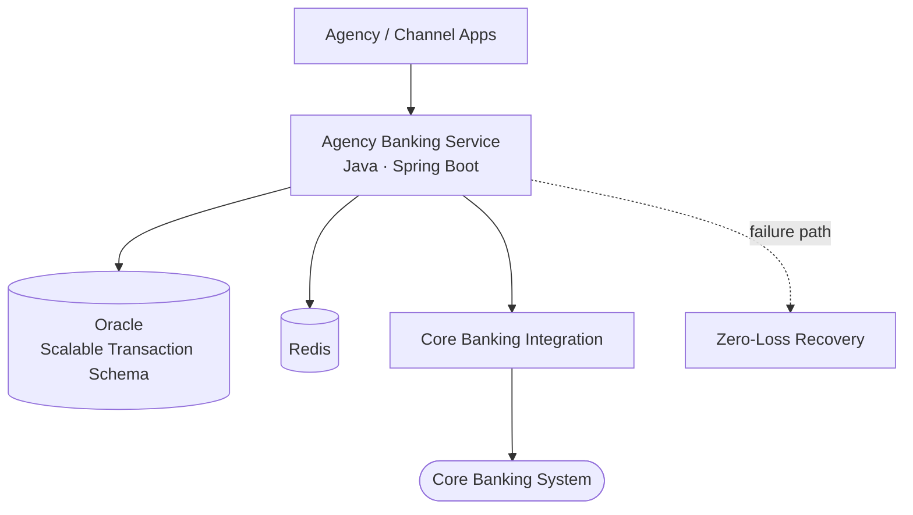
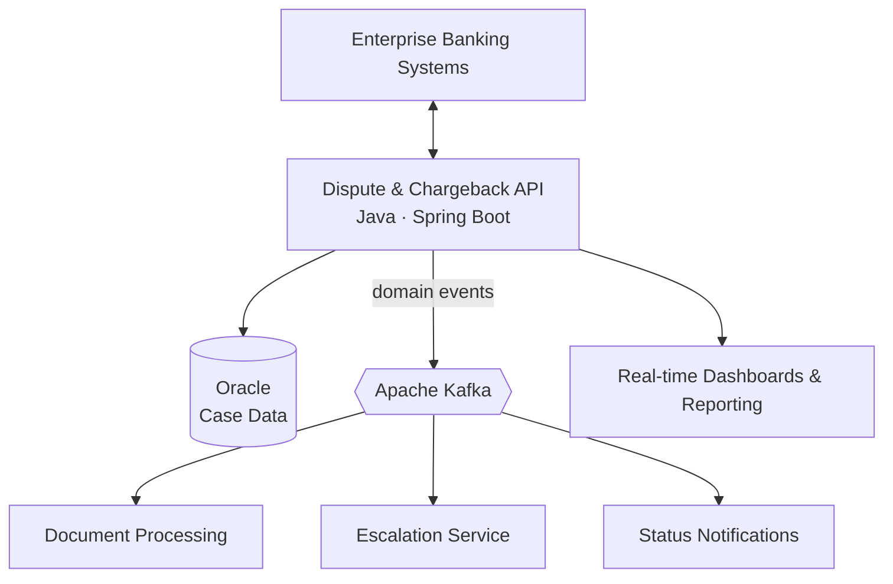

<!-- ════════════════════════════════════════════════════════════════
     Han Lynn Aung · GitHub Profile README
     NOTE: this file is auto-updated by GitHub Actions.
     Do not rename or reformat the waka-time section markers,
     the blog-post-list markers, the snake SVGs served from the
     output branch (main.yml), or the profile-3d-contrib SVG
     regenerated every 6 hours (profile-3d.yml).
     ════════════════════════════════════════════════════════════════ -->

# Han Lynn Aung

**Java Backend Engineer** · Enterprise Fintech & Banking Systems

Building scalable backend systems with Java and Spring Boot — microservices, core banking integrations, and fault-tolerant transaction pipelines engineered for zero data loss under heavy concurrency.

Based in Myanmar · Open to collaboration

[](https://hanlynnaung-portfolio-74ixsmgju-han-lynn-aung.vercel.app/)
[](https://www.linkedin.com/in/hanlynn-aung/)
[](mailto:hanlynnaung1997@gmail.com)
[](https://medium.com/@hanlynnaung1997)

---

## About

I'm a **Java Backend Engineer** with **3+ years** of production experience building enterprise-grade systems for the fintech and banking domain — from core banking integrations to centralized dispute platforms.

- **Enterprise backend focus** — scalable microservices, resilient REST APIs, and transaction pipelines where data integrity is non-negotiable.
- **Reliability engineering** — zero-loss failure handling and safe concurrent processing under heavy load.
- **Mentorship** — guiding interns and management trainees from requirements to production delivery.
- **Currently deepening** — system design, event-driven architecture, and cloud-native deployment.

---

## Core Stack

| Area | Technologies |
|---|---|
| **Languages** | Java · SQL · TypeScript |
| **Backend** | Spring Boot · Spring Security · Hibernate · REST APIs · Maven · Gradle |
| **Data** | Oracle · PostgreSQL · MySQL · Redis · MongoDB |
| **Messaging** | Apache Kafka · RabbitMQ |
| **Cloud & DevOps** | AWS · Docker · Kubernetes · GitHub Actions · Jenkins · Nginx |
| **Observability & Testing** | Prometheus · Grafana · JUnit 5 · Mockito · Postman |
| **Tools** | Git · IntelliJ IDEA · Swagger |

**Primary** — Java · Spring Boot · REST API design · Oracle · SQL

**Secondary** — Redis · Kafka · Docker · AWS · PostgreSQL · Git

*Working knowledge* — React · Tailwind CSS · JavaScript · HTML/CSS

---

## Engineering Focus

### Backend Engineering

- REST API design and enterprise application development
- Spring Boot service architecture
- Database integration, optimization, and transaction management
- Concurrency control in high-volume systems

### Architecture

- Microservices and distributed systems
- Event-driven processing with Kafka
- Multi-system enterprise integration
- Scalable data modeling

### Reliability

- Zero-loss failure recovery in transaction flows
- Safe simultaneous processing under heavy concurrency
- Observability with Prometheus and Grafana
- Automated testing with JUnit 5 and Mockito

---

## Featured Projects

### 01 · Agency Banking Platform

Core banking integration with high-reliability transaction processing.

**Problem** — Agency-channel transactions demand strict integrity: a failed transaction must never be lost, even while thousands process concurrently.

**Solution** — A transaction platform integrating core banking services with concurrency-safe processing and guaranteed recovery on failure.

**Architecture** — Spring Boot services over a scalability-oriented Oracle schema, with Redis on performance-critical paths. Structural bottleneck analysis drove throughput improvements across the flow.


```mermaid
flowchart TB
    AG["Agency / Channel Apps"] --> API["Agency Banking Service<br/>Java · Spring Boot"]
    API --> DB[("Oracle<br/>Scalable Transaction Schema")]
    API --> RD[("Redis")]
    API --> CB["Core Banking Integration"]
    CB --> BANK(["Core Banking System"])
    API -. "failure path" .-> RC["Zero-Loss Recovery"]
```

`Java · Spring Boot · Oracle · Redis`

**Highlights**

- Zero data loss on transaction failures
- Resolved structural bottlenecks — improved speed and throughput
- Concurrency-safe simultaneous transaction processing
- Scalable database architecture for large-scale operation volumes

*Built at KBZ Bank — enterprise banking platform; repository not public.*

---

### 02 · Dispute & Chargeback Platform

Centralized dispute management with automated workflows.

**Problem** — Dispute and chargeback operations span banking rules, compliance requirements, and multiple internal systems — slow and error-prone when handled manually.

**Solution** — A centralized case-management platform that translates banking and compliance requirements into intuitive workflows with automation at every step.

**Architecture** — Spring Boot with Oracle persistence, connected to enterprise systems through Kafka-based event flow; automated document processing, escalation, and notification services feeding real-time dashboards.


```mermaid
flowchart TB
    BANK["Enterprise Banking Systems"] <--> API["Dispute & Chargeback API<br/>Java · Spring Boot"]
    API --> DB[("Oracle<br/>Case Data")]
    API -- "domain events" --> K{{"Apache Kafka"}}
    K --> DOC["Document Processing"]
    K --> ESC["Escalation Service"]
    K --> NTF["Status Notifications"]
    API --> DASH["Real-time Dashboards & Reporting"]
```

`Java · Spring Boot · Oracle · Apache Kafka`

**Highlights**

- Streamlined end-to-end case-management workflows
- Automated document processing, escalations, and status notifications
- Multi-system enterprise integration
- Real-time dashboards and automated reporting for leadership

*Built at KBZ Bank — enterprise banking platform; repository not public.*

---

### 03 · Loyalty & Rewards Integration

Cross-system rewards integration delivered on schedule.

**Problem** — Reward data lived across multiple core systems, producing discrepancies and unreliable reporting.

**Solution** — Cross-platform API integration with disciplined coordination across QA, product, and finance teams to resolve data mismatches before launch.

**Architecture** — REST integrations across multiple core systems built on Spring Boot with MySQL persistence.

`Java · Spring Boot · MySQL · REST APIs`

**Highlights**

- Integrated APIs across multiple core systems
- Resolved cross-team data discrepancies
- Improved reporting accuracy and operational efficiency
- Mentored interns and trainees through successful delivery

*Built at Capital Diamond Star Group — enterprise rewards platform; repository not public.*

---

### 04 · Edible Oil Distribution System

Distribution management for the edible oil supply chain.

`Java · Spring Boot · MySQL`

*Built at Capital Diamond Star Group — enterprise platform; repository not public.*

---

### 05 · Merchants Portal

Merchant onboarding and self-service portal.

`Java · Spring Boot · React · MySQL`

*Built at Capital Diamond Star Group — enterprise platform; repository not public.*

---

## Open Source & Side Projects

| Project | Focus |
|---|---|
| [Myanmar-NRC-and-Phone-Number-Validator](https://github.com/hanlynn-aung/Myanmar-NRC-and-Phone-Number-Validator) | Myanmar NRC format and phone number validation |
| [learning-mircroservice](https://github.com/hanlynn-aung/learning-mircroservice) | Hands-on microservices exploration |
| [ecom](https://github.com/hanlynn-aung/ecom) | E-commerce project |
| [social-media](https://github.com/hanlynn-aung/social-media) | Social media application |

---

## Experience

**Java Backend Engineer** — [KBZ Bank](https://www.kbzbank.com/en/) · 2025 – Present

- Build and operate microservices for core banking integration and dispute management platforms
- Design REST APIs for transaction processing integrated with enterprise banking services
- Mentor interns and management trainees through production deliveries

**Backend Developer** — [Capital Diamond Star Group](https://cdsg.com.mm/) · 2023 – 2025

- Delivered the cross-system Loyalty & Rewards integration and an Edible Oil Distribution System
- Built a Merchants Portal (Spring Boot + React) with onboarding and self-service flows
- Developed REST APIs with database optimization for e-governance portals
- Implemented secure user management systems

**Java Developer Bootcamp** — JDC One Stop · 2022

- Completed an intensive one-stop Java developer bootcamp

---

## GitHub Activity

<div align="center">
  <picture>
    <source media="(prefers-color-scheme: dark)" srcset="https://raw.githubusercontent.com/hanlynn-aung/hanlynn-aung/output/github-contribution-grid-snake-dark.svg" />
    <source media="(prefers-color-scheme: light)" srcset="https://raw.githubusercontent.com/hanlynn-aung/hanlynn-aung/output/github-contribution-grid-snake.svg" />
    
  </picture>
</div>

<div align="center">
  
</div>

### Weekly Code Breakdown

<!--START_SECTION:waka-->

```txt
From: 31 January 2024 - To: 23 August 2026

Total Time: 214 hrs 48 mins

Java                                   195 hrs 32 mins       ██████████████████████▓░░   91.02 %
SQL                                    7 hrs 44 mins         █░░░░░░░░░░░░░░░░░░░░░░░░   03.60 %
YAML                                   4 hrs 14 mins         ▒░░░░░░░░░░░░░░░░░░░░░░░░   01.97 %
Log                                    2 hrs 21 mins         ▒░░░░░░░░░░░░░░░░░░░░░░░░   01.10 %
XML                                    2 hrs                 ▒░░░░░░░░░░░░░░░░░░░░░░░░   00.93 %
```

<!--END_SECTION:waka-->

---

## Writing

Notes on backend engineering and software development.

[Medium — @hanlynnaung1997](https://medium.com/@hanlynnaung1997) · [Substack — hanlynnaung](https://substack.com/@hanlynnaung)

<!-- BLOG-POST-LIST:START -->
- [HIBERNATE 6 | HIBERNATE ADVANCED
Implement your primary key as a Record using an IdClass](https://medium.com/@hanlynnaung1997/hibernate-6-hibernate-advanced-implement-your-primary-key-as-a-record-using-an-idclass-172bedc2f8dc?source=rss-a0a3cdee224d------2) - Sat Jun 15 2024 5:12 PM<!-- BLOG-POST-LIST:END -->

---

## Let's Connect

Interested in backend engineering, system architecture, or collaboration?

[](https://www.linkedin.com/in/hanlynn-aung/)
[](mailto:hanlynnaung1997@gmail.com)
[](https://hanlynnaung-portfolio-74ixsmgju-han-lynn-aung.vercel.app/)
